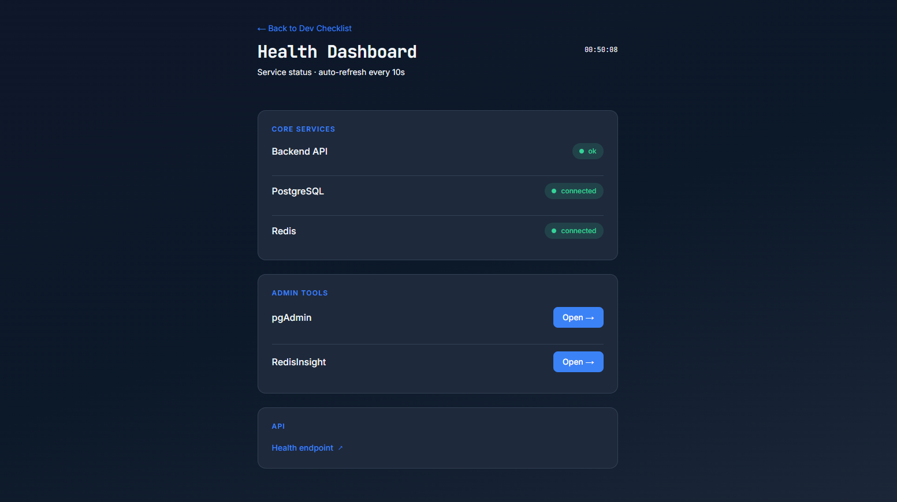

<div align="center">
  
</div>

# StackLift

Self-hosted dev environment starter. One command starts frontend (Next.js), backend (Express), PostgreSQL, Redis, pgAdmin, and RedisInsight.

**By [Statix](https://statsly.org/)** – Side project alongside [Statsly](https://statsly.org/), actively maintained and updated.

```bash
git clone https://github.com/Statsly-org/StackLift.git
cd StackLift
```

---

## Preview



---

## Quick Start

```bash
# 1. Run setup (creates .env, pgpass)
./scripts/setup.sh

# 2. Start everything
docker compose up
```

- **Frontend:** http://localhost:3000  
- **Backend API:** http://localhost:3001  
- **pgAdmin:** http://localhost:5050  
- **RedisInsight:** http://localhost:5540  

### Development (file watch)

For live reload when editing code:

```bash
docker compose -f docker-compose.yml -f docker-compose.dev.yml up
```

Changes to `backend/` and `frontend/` are picked up automatically. No rebuild needed.

**To see changes:**
- **Frontend:** Save a file → browser refreshes (or use hot reload)
- **Backend:** Save a file → API restarts automatically
- No `docker compose build` or container restart needed

### Windows

`setup.sh` requires Bash. On Windows:

1. Copy `stacklift.config.env.example` to `stacklift.config.env`
2. Create `.env` with the same variables as in the setup script output (see [scripts/setup.sh](scripts/setup.sh) for the template)
3. Create `config/pgadmin/pgpass` with: `postgres:5432:*:postgres:YOUR_PASSWORD`
4. Run `docker compose up`

Or use WSL or Git Bash to run `./scripts/setup.sh`.

---

## What's Included

| Service   | Port | Description                    |
|-----------|------|--------------------------------|
| Frontend  | 3000 | Next.js app                    |
| Backend   | 3001 | Express API                    |
| PostgreSQL| 5432 | Database                       |
| Redis     | 6379 | Cache / sessions               |
| pgAdmin   | 5050 | PostgreSQL admin UI           |
| RedisInsight | 5540 | Redis admin UI             |

---

## Configuration

Edit `stacklift.config.env` (copy from `stacklift.config.env.example` if needed). The setup script reads it and generates `.env` for Docker Compose.

| Variable | Default | Description |
|----------|---------|--------------|
| `POSTGRES_USER` | postgres | DB user |
| `POSTGRES_PASSWORD` | postgres | DB password |
| `POSTGRES_DB` | stacklift | DB name |
| `PGADMIN_EMAIL` | admin@stacklift.dev | pgAdmin login |
| `PGADMIN_PASSWORD` | admin | pgAdmin password |
| `FRONTEND_PORT` | 3000 | Frontend port |
| `BACKEND_PORT` | 3001 | Backend port |
| `PGADMIN_PORT` | 5050 | pgAdmin port |
| `REDISINSIGHT_PORT` | 5540 | RedisInsight port |

---

## Project Structure

```
StackLift/
├── backend/          # Express API
├── frontend/         # Next.js app
├── database/init/    # PostgreSQL init scripts
├── config/pgadmin/   # pgAdmin config
├── img/              # Screenshots and assets
├── scripts/
│   ├── setup.sh      # Setup script
│   ├── lint.bat / lint.sh    # Run lint in backend + frontend
│   ├── build.bat / build.sh  # Run build in both
│   └── install.bat / install.sh  # npm install in both
├── stacklift.config.env.example
└── docker-compose.yml
```

### Root scripts (lint, build, install)

From project root, run lint/build/install across backend and frontend:

- **Windows:** `scripts\lint.bat`, `scripts\build.bat`, `scripts\install.bat`
- **Linux/macOS:** `./scripts/lint.sh`, `./scripts/build.sh`, `./scripts/install.sh`

---

## License

MIT. See [LICENSE](LICENSE).

---

<div>
  
</div>

*StackLift by [Statix](https://statsly.org/)*
